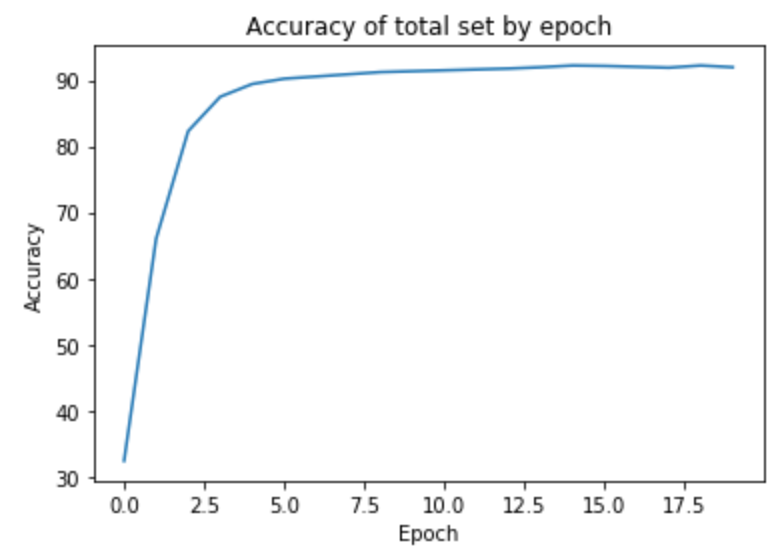
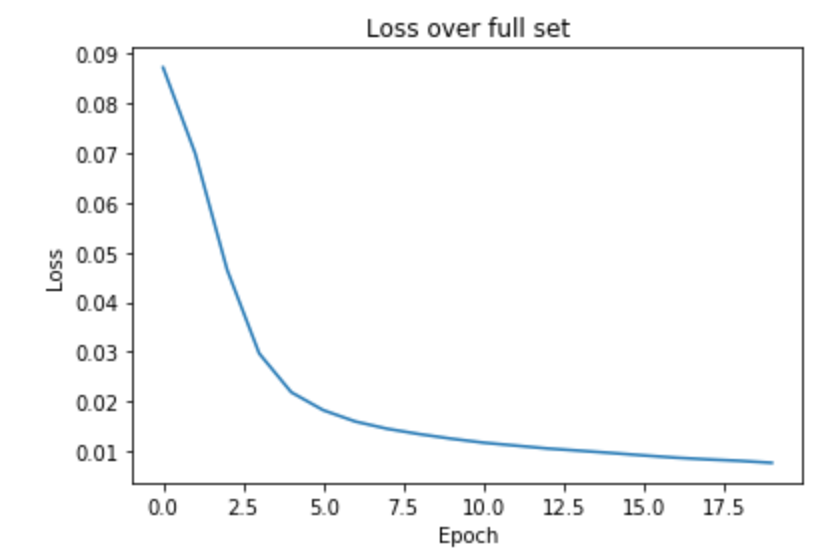
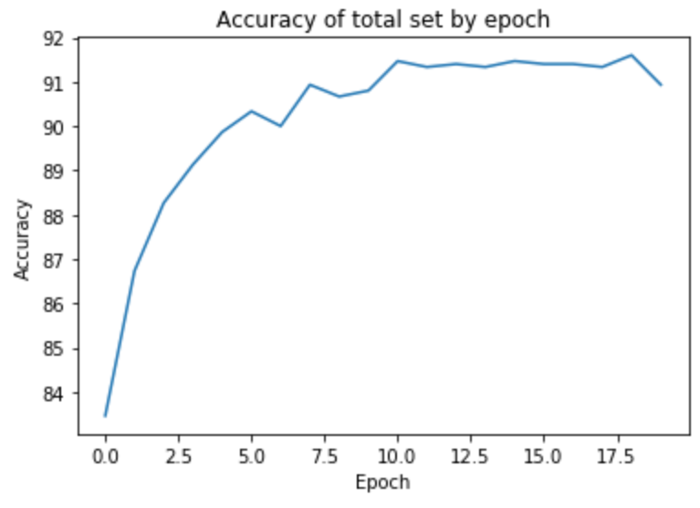
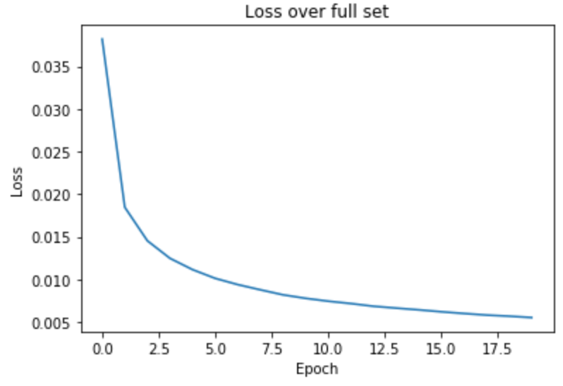

# Multiclass Classification of 5000 handwritten digits.

**1. Creating and training a 2 layer ANN in pytorch**

**2. Training the network with Pre-trained features**

**3. Comparison with a Multiclass regularized logistic regression strategy**


---
Build instructions:
```
git clone
jupyter notebook ANNclassifier.ipynb
```

## Creating and training a 2 layer ANN in pytorch.

It was determined from the data that the dataset consists of handwritten (MNIST) data. This consists of `5000` `20x20` images with a few examples shown below:

<p align="center">
  
</p>

With this dataset and classification task, I built a small two layer ANN using Pytorch with the basic structure of two fully connected layers using Sigmoid activation as seen below:

```
fc1 = nn.Linear(400,25)
fc2 = nn.Linear(25,10)

#A fully connected layer using Sigmoid activication
x = Sigmoid(fc1(x))
#Another fully connected layer and apply Softmax
x = Softmax(fc2(x))
```

Since the total size of the Dataset is small (`5000` instances), I used a Stochastic Gradient Descent over 1 image for each epoch rather than for a batch of images. I chose a train/test split of `30%` to evaluate the model. The parameters that were used:

```
epochs = 20
test_size = 30%
SGD learning rate = 0.2
momentum = 0
dampening = 0
loss = MSE loss
```

Before training, the accuracy of the network was `10.34%` which is as accurate as random guessing. After training, over `20 epochs`, our accuracy reached `92.2%` which is resonable considering the dataset contains numbers that even humans have difficulty detecting e.g the 2 in figure 1. Below are figures of our training process across epochs.

<p align="center">
  
</p>

## Loading and training pre-trained features.

I loaded the pre-trained weights using my function `classifier.loadWeight(weights)`. These weights are not from pytorch and the exact formatting and network structure is unknown. However, I hypothesize that they provide some learned features to my ANN structure because the accuracy after loading these weights is `34.46%`. Possibly in the other network there is some form of feature scaling or other data augmentations.

The training of the weights also differed. There was fluctuating accuracy past the 5th epoch which continued to persist but reduced in intensity. This could be because of the local minima that fit but not fully fit my network in the loaded weights. The accuracy and losses are below.

<p align="center">
  
</p>

## Implementation of L2 regularized logistic regression with (One vs Many).

To compare my NN model with a more traditional model, I implemented
