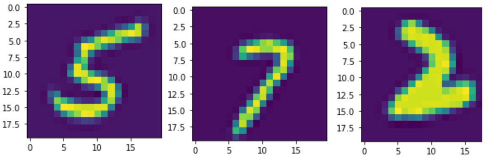

# Multiclass Classification of 5000 handwritten digits.

**1. Creating and training a 2 layer ANN in pytorch**

**2. Training the network with Pre-trained features**

**3. Comparison with a Multiclass regularized logistic regression strategy**


---
Build instructions:
```
git clone
jupyter notebook ANNclassifier.ipynb
```

## Creating and training a 2 layer ANN in pytorch.

It was determined from the data that the dataset consists of handwritten (MNIST) data. This consists of `5000` `20x20` images with a few examples shown below:

<p align="center">
  
</p>
